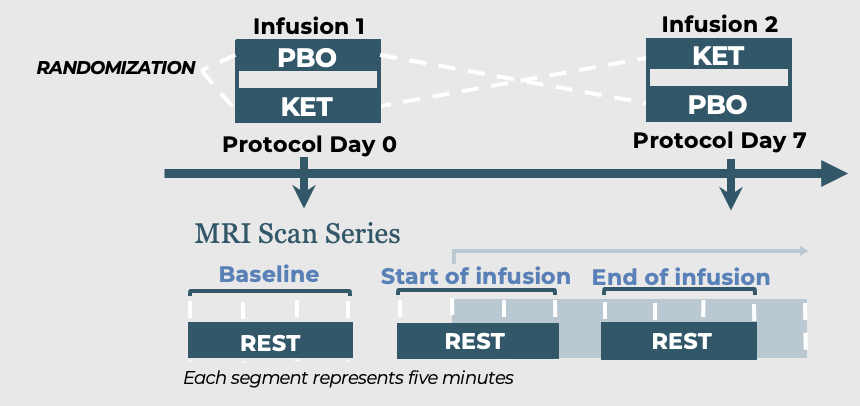

# HRV Collaboration Pipeline

This repository offers a pipeline to study the physiological effects of an infusion given during an MRI scan on individuals with mood disorders. It enables the collection, processing, and analysis of data such as heart rate (HR), helping researchers explore the infusion's impact on physiological parameters related to mood disorder symptoms.

## Study Design and Time Points

Our study is a double-blind crossover study with a sub-anesthetic dose of ketamine (0.5 mg/kg) and saline as the placebo.

*Each rest scan lasted approximately 15 minutes.*

## Data Collection

Data (HR and respiratory rate) was collected during MRI scans and saved using the [BIDS format](https://bids-specification.readthedocs.io/en/stable/modality-specific-files/physiological-and-other-continuous-recordings.html).

### File Naming Convention
- **Baseline**: `run-01`
- **Start of Infusion**: `run-101`
- **End of Infusion**: `run-201`

*See the folder of Test_Subjects_Physio_Input.*

We used a JSON file with the scanning rate (`srate`) and saved our physiological data in a tab-separated file with three numeric columns containing the respiratory rate and heart rate.

*If your scanning rate is consistent for all scans, you may input the `srate` manually instead of using JSON files. Additionally, if your data is not saved in the tab format, make sure to reformat your data or edit the code.*

## Python Files

### Setup Instructions
Before using the notebooks, ensure:
1. `environment.yml` is downloaded.
2. A virtual environment is created.
3. The HRV analysis environment is activated.

### Notebooks
- **`nk_hrv_singlefile_sample.ipynb`**: Process a single scan; useful for initial pipeline testing.
- **`nk_hrv_loop_sample.ipynb`**: Process all scans and output results into a single CSV file.

#### Inputs
- Physiological data file.
- Optional JSON file.

*See the folder of Test_Subjects_Physio_Input.*

#### Outputs
- `Subject_number`
- `Session_date`
- `Task`
- `Run`
- `Echo`
- `State`
- `PPG_Rate_Mean`
- Various heart rate variability (HRV) measures.

*See the folder of Test_Subjects_Physio_Output.*

## R Markdown

This file can be used to:
1. Check if BMI, age, and gender are available to determine if they are confounding variables.
2. Combine MADRS (mood rating) scores with `HRV_Data_Loop_Test` (output file).
3. Perform statistical analysis.
4. Plot:
   - Mood Rating Before and After Infusion
   - Average HR at Scan Time Points
   - Average HRV at Scan Time Points
   - Effect of Placebo on HRV
   - Correlation Between Change in Mood Rating and HR Level at the End of the Infusion
